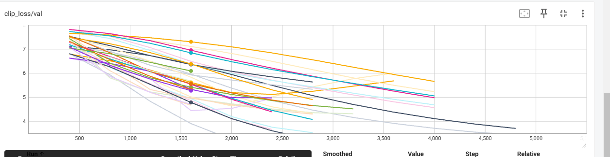

<!-- Author: Sun Rui -->
<!-- email: sunrui171@mails.ucas.edu.cn>
<!-- Date: 2025.03.03 -->
<!-- Description: This is a template for writing remark notes. -->

<h1 style="text-align:center;">Remark Template</h1>
<!-- Change the title as "The Remark of {paper title}" -->

<div style="text-align:right;">
  Author: Sun Rui ， Date: 2025.03.03  
</div>

## Method Overview:

- Target: Provide a template for remark notes.
- Input data: Gene expression $X \in R^{n\times d}$
- Output data: Perturbed expression $Y \in R^{n\times 1}$
- Model structure: VAE based 
- Innovation: UseVAE to predict the perturbed expression

## Method Details:

In this part, you should provide a detailed description of the model used. 

The "details" has two meaning. First, you should provide the pseudo code of the model, tell the reader how the model works, e.g.(This is a pseudo code generated by Qwen2.5-max(beta), it might be wrong)

$$
\begin{aligned}
&\textbf{Algorithm:} \text{VAE-Based Perturbation Prediction} \\
&\textbf{Input:} \text{Gene expression matrix } X \in \mathbb{R}^{n \times d} \\
&\textbf{Output:} \text{Perturbed expression } Y \in \mathbb{R}^{n \times 1} \\
&\text{1. Initialize the VAE model parameters } \theta. \\
&\text{2. Encode the input data } X \text{ into latent space } Z: \\
&\quad Z = \text{Encoder}(X; \theta_{\text{encoder}}) \\
&\text{3. Decode the latent representation } Z \text{ to reconstruct } X: \\
&\quad \hat{X} = \text{Decoder}(Z; \theta_{\text{decoder}}) \\
&\text{4. Compute the reconstruction loss } L_{\text{recon}}: \\
&\quad L_{\text{recon}} = \|X - \hat{X}\|^2 \\
&\text{5. Predict the perturbed expression } Y: \\
&\quad Y = \text{PerturbationModel}(Z; \theta_{\text{perturb}}) \\
&\text{6. Compute the total loss:} \\
&\quad L_{\text{total}} = L_{\text{recon}} + \lambda \cdot L_{\text{perturb}} \\
&\text{7. Update model parameters } \theta \text{ using gradient descent.} \\
&\text{8. Return the predicted perturbed expression } Y.
\end{aligned}
$$

<font color='red'> Actually, This pseudo code is too detailed, I think writing like this is ok:</font>

```python

# X \in R^{n\times d}

- encoder: X (N,d) --> mu (N,d0), sigma (N,d0)
- reparam: z (N, d0) = mu + sigma * torch.randn(N,d0) 
- decoder: z (N,d0) --> X_hat (N,d)
```


For convenience, you can also use the screenshot, remember to save the figure in the fig dir.



Second, the details can also include the mathematical theory of the model, but this is not necessary. We hope this remark note to be a practical guide, help the reader to understand the pipeline of the algorithm and implement it. 

## Evaluation:

- evaluation metrics: (tell the users how to perform the evaluation)
- evaluation dataset: (use which dataset)
- comparing methods:  
- main result:

## Discussion:

You could write your review about the paper here. You could write anything legal, but be responsible for your words. 

- Advantages: 
- Shortcomings: